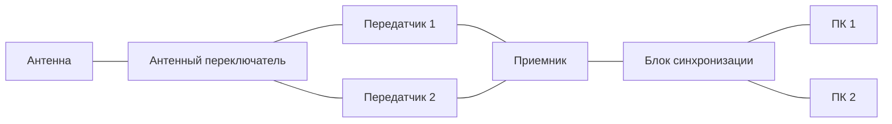
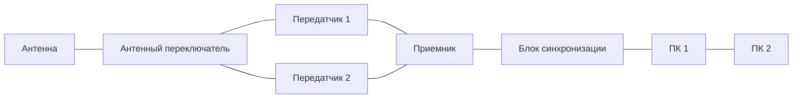
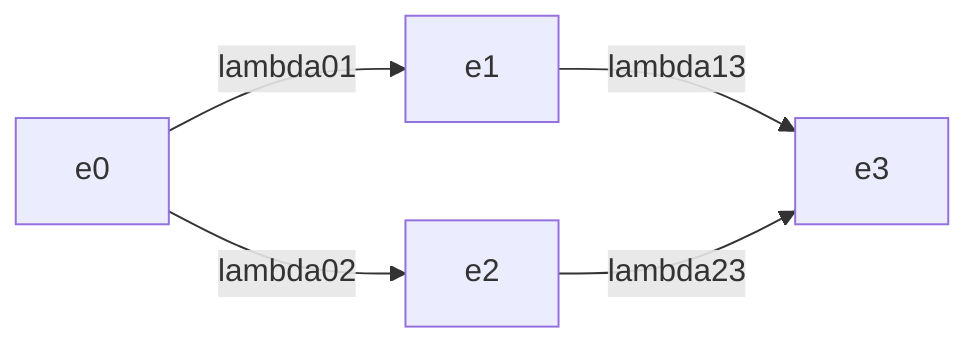
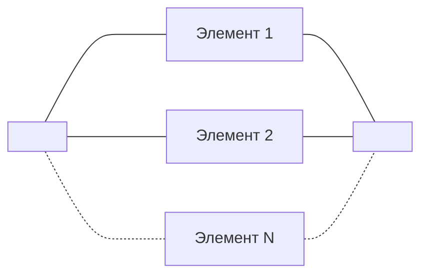
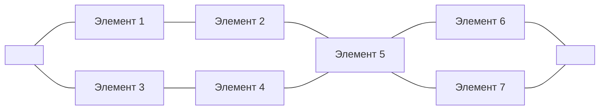
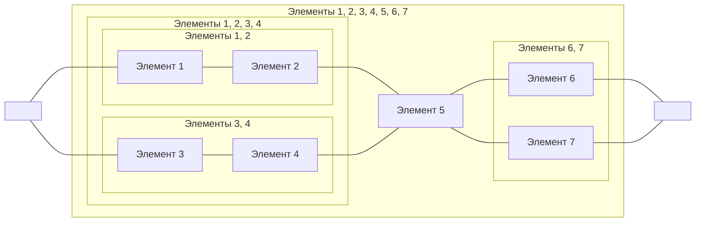

13-03-2023

Лекция 6

---

Вопросы:
1. Формализация описания объектов КС при расчетах надежности
2. Основные расчетные соотношения для показателей безотказности объектов КС
3. Приближенные методы расчета безотказности объектов КС

# Вопрос 1
Под расчетом надежности будем понимать определение значений показателей надежности объекта по известным значениям показателей надежности элементов этого объекта при заданных условиях эксплуатации

В зависимости от определяемых показателей надежности в конкретных случаях можно говорить о расчете безотказности, ремонтопригодности, долговечности и сохраняемости

В основе любого расчета всегда лежит определенная математическая модель, с помощью которой в формальном виде задаются все условия работоспособных и (или) исправных состояний данного объекта

Виды моделей:
- Структурная схема надежности (ССН)
- Граф состояний и переходов

## Структурная схема надежности
Под ССН понимают графическое представление условий работоспособности объекта

Правила построения ССН:
1. Если отказ элемента приводит к отказу некоторой части объекта, то на ССН такой элемент соединяется последовательно с другими элементами этой части объекта
2. Если отказ любого элемента приводит к отказу всего объекта, то на ССН все элементы включаются последовательно
3. Если отказ элемента не приводит к отказу некоторой части объекта, то на ССН такой элемент соединяется параллельно с остальными элементами этой части объекта
4. Параллельное включение элементов на ССН является постоянным резервированием элементов по существу

Пример:

Вид одного и того же объекта может зависеть от условий функционирования объекта

## Граф состояний и переходов
Используется в качестве модели объекта КС в том случае, когда целесообразно рассматривать множество состояний объекта

Вершины графа обозначают различные технические состояний объекта КС, а дуги (стрелки) - возможные переходы между состояниями

$e_0$ - оба объекта работоспособны, $e_1$ - объект 1 работоспособен, объект 2 неработоспособен, $e_2$ - объект 1 неработоспособен, объект 2 работоспособен, $e_3$ - оба объекта работоспособны

$\lambda_{ij}$ - интенсивность перехода из состояния $i$ в состояние $j$

Расчеты надежности могут быть приближенными и полными. Чем больше имеется информации о надежности элементов объектов КС и условиях их функционирования, тем более полным может быть расчет надежности

Приближенный расчет надежности применяется на ранних стадиях разработки объектов КС

Полный расчет надежности применяется на завершающих стадиях разработки

# Вопрос 2
1. Последовательное соединение элементов

Вероятность безотказной работы: $P(t) = \prod_{i=1}^N P_i(t)$

Вероятность отказа известна, следовательно: $P(t) = \prod_{i=1}^N (1-q(t))$

Интенсивность отказов: $\lambda(t) = \sum_{i=1}^N \lambda_i(t)$

$T_{ср} = \int_0^\infty P(t)dt = \int_0^\infty e^{-\int_0^t \lambda(x)dx}dx$

Формулы для получения показателей надежности:
- $\lambda(t) = \lambda = const$
- $P(t) = e^{-\lambda t}$
- $q(t) = 1 - e^{-\lambda t}$
- $f(t) = \lambda \cdot e^{-\lambda t}$
- $T_{ср} = T_0 = \frac{1}{\lambda}$

2. Параллельное соединение элементов

$q(t) = \prod_{i=1}^N q_i(t)$

$\lambda(t) \neq \sum_{i=1}^N \lambda_i(t)$

- $q(t) = 1 - 2e^{-\lambda t} + 2e^{-2\lambda t}$
- $P(t) = e^{-\lambda t} \cdot (2 -e^{-\lambda t})$
- $f(t) = 2\lambda \cdot e^{-\lambda t} (1 - e^{-\lambda t})$
- $\lambda(t) = \frac{2\lambda (1 - e^{-\lambda t})}{2 - e^{-\lambda t}}$
- $T_{ср} = \frac{1.5}{\lambda}$

3. Последовательно-параллельное соединение элементов

> [!tip] Важно
>
> Методика расчета начинается и заканчивается через вероятность безотказной работы

Элементы заменяются эквивалентными элементами

# Вопрос 3
Общие ограничения для методов расчета надежности:
1. Объект КС должен быть представлен общей ССН с последовательным соединением элементов
2. Отказы элементов объекта независимые
3. наработка до отказа элементов подчинена экспоненциальному закону

## Расчет безотказности по средней условной интенсивности отказов
Используется на начальных этапах проектирования

Суть метода: средняя интенсивность отказов одного элемента $\lambda_{ср}$ для аппаратуры одного класса, выполненной на одной элементной базе как правило одинаково, и не зависит от числа элементов объекта

$\lambda = \frac{N \cdot \lambda_{ср}}{r}$

$T_0 = \frac{r}{N \cdot \lambda_{ср}}$

$N$ - общее число элементов проектируемого объекта, $r$ - коэффициент, учитывающий эксплуатацию объекта

## Расчет безотказности по номинальным значениям интенсивности отказов элемента
Данный метод применяется на этапе разработки принципиальной схемы аппаратуры и выбора типов элемента

1. Все элементы разбиваются на группы с примерно одинаковыми номинальными значениями интенсивности отказов и для каждой группы определяется число элементов $N$
2. При необходимости определяются значения интенсивности отказов элементов каждой группы $\lambda_{0i}$
3. Рассчитывается суммарная интенсивность отказов объектов по формуле $\lambda = \sum_{i = 1}^m N_i \cdot \lambda_{0i}$
4. Рассчитывается $T_0 = \frac{1}{\lambda}$, $P(t) = e^{-\lambda t}$

# Практика
## Задача 1

Для каждого из элементов даны интенсивности отказов: $\lambda_1 = \lambda_3 = 2 \cdot 10^{-3}$, $\lambda_2 = \lambda_4 = \lambda_6 = \lambda_7 = 10^{-3}$, $\lambda_5 = 10^{-4}$

Наработка до отказа каждого элемента подчинена экспоненциальному закону распределения

Необходимо определить:
1. Вероятность безотказной работы $P(t)$ для значений наработки $t = 100, 200, 500, 1000$ часов
2. По полученным данным построить графики и сделать выводы

Решение:

$P_{1, 2}(t) = P_1(t) \cdot P_2(t) = e^{-0.003t}$

$P_{3, 4}(t) = P_3(t) \cdot P_4(t) = e^{-0.003t}$

$P_{1, 2, 3, 4}(t) = 1 - (1 - P_{1, 2}(t)) \cdot (1 - P_{3, 4}(t)) = 2e^{-0.003t} - e^{-0.006t}$

$P_{6, 7}(t) = 1 - (1 - P_6(t)) \cdot (1 - P_7(t)) = 2e^{-0.001t} - e^{-0.002t}$

$P(t) = P_{1, 2, 3, 4}(t) \cdot P_5(t) \cdot P_{6, 7}(t) = 4e^{-0.004t} - 2e^{-0.0071t} - 2e^{-0.005t} - e^{-0.0081t}$

$P(100) = \ldots$

$P(200) = \ldots$

$P(500) = \ldots$

$P(1000) = \ldots$
