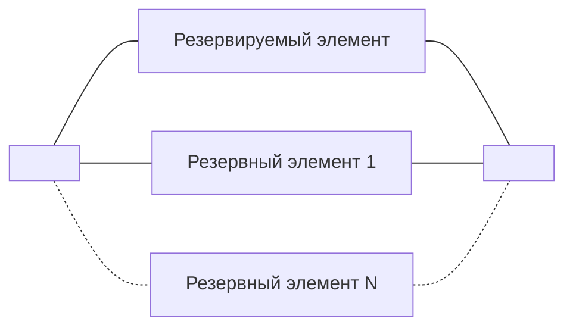

20-03-2023

Лекция 7

---

Вопросы:
1. Резервирование - один их эффективных методов обеспечения высокой надежности КС
2. Факторы, влияющие на надежность компьютерных систем

# Вопрос 1

Резервирование - применение дополнительных средств и (или) возможностей с целью сохранения работоспособного состояния объекта при отказе одного или нескольких его элементов

Виды резервирования:
1. Структурное - резервирование с применением резервных элементов структуры объекта
2. Временное - резервирование с применением резервов времени (повышение производительности труда)
3. Информационное - резервирование с применение резервов информации
4. Функциональное - резервирование с применением функциональных резервов
5. Нагрузочное - резервирование с применением нагрузочных резервов

## Основные понятия
Основной элемент - это элемент структуры объекта, необходимый для выполнения объектом требуемых функций при отсутствии отказов его элементов

Резервный элемент - это элемент объекта, предназначенный для выполнения функций основного элемента в случае отказа последнего

Резервируемый элемент - это основной элемент, на случай отказа которого в объекте предусмотрен резервный элемент

Кратность резерва - это отношение числа резервных элементов объекта к числу резервируемых или основных элементов объекта, выраженное несокращенной дробью

## Методы структурного резервирования
1. По виду соединения основных и резервных элементов
	- Раздельное - резервирование, при котором резервируемыми являются отдельные элементы объекта или их группы
	- Общее - резервирование, при котором резервируемым элементов является объект в целом
	- Смешанное - это сочетание различных видов резервирования
2. По способу подключения резервных элементов
	- Постоянное - резервирование без перестройки структуры объекта при возникновении отказа
	- Динамическое - резервирование с перестройкой структуры объекта при возникновении отказа его элемента
	- Замещением - динамическое резервирование, при котором функции основного элемента передаются резервному после отказа основного элемента
	- Скользящее - резервирование замещением, при котором группа основных элементов объекта резервируется одним или несколькими резервными элементами, каждый из которых может заменить любой отказавший элемент данной группы
3. По степени нагруженности резервных элементов
	- Ненагруженное - резерв, который содержит один или несколько резервных элементов, находящихся в режиме основного элемента
	- Облегченное - резерв, который содержит один или несколько резервных элементов, находящихся в менее нагруженном режиме, чем основной
	- Нагруженное - резерв, который содержит один или несколько резервных элементов, находящихся в ненагруженном режиме до начала выполнения ими функций основного элемента
4. По наличию восстановления резерва
	- С восстановлением - резерв, который содержит один или несколько резервных элементов работоспособность которых при возникновении их отказа подлежит восстановлению при эксплуатации
	- Без восстановления - резерв, который содержит один или несколько резервных элементов работоспособность которых при возникновении их отказа восстановлению при эксплуатации не подлежит

## Расчет надежности резервируемых объектов без восстановления
### Нагруженное резервирование с замещением
$\eta = \frac{T_{ср1,1}}{T_{ср}} = \frac{1.5T_{ср}}{T_{ср}} = 1.5$

Средняя наработка до отказа дублированной системы при нагруженном резерве в 1.5 раза превышает среднюю наработка до отказа основного элемента

### Ненагруженное резервирование с замещением
$P_{1,1}(t) = 2$

$T_{ср1,1} = 2T_{ср}$

### Скользящее ненагруженное резервирование
$\eta = m + 1$, где $m$ - количество резервных элементов

## Выводы
1. При одинаковых кратностях и методе резервирования показатели надежности тем выше, чем легче режим резервного элемента
2. Наиболее эффективным следует считать ненагруженный режим, при котором средняя наработка на отказ пропорциональна числу элементов резервируемой системы
3. Самые низкие показатели имеет нагруженный режим, у которого добавочная наработка при увеличении на $1$ числа резервных элементов падает
4. Режим облегченного резерва дает промежуточный результат. При методе постоянного включения вследствие того, что при облегченном резерве улучшаются условия работы системы может быть получен значительный выигрыш в надежности
5. Наибольший выигрыш в надежности обеспечивает первый резервный элемент

# Вопрос 2
Основные факторы:
1. Влияние времени эксплуатации
	- Причиной старения являются сложные физико-климатические процессы, происходящие в элементах объектов КС в течение всего периода эксплуатации (структурные изменения в диэлектриках, нарушение электрической и механической прочности материалов и конструкций и др.)
2. Влияние деятельности обслуживающего персонала
	- Квалификация обслуживающего персонала
	- Соблюдение правил технической эксплуатации
	- Степень организованности системы технического обслуживания
3. Другие факторы
	- Влияние температуры, влажности и атмосферных осадков
	- Влияние механических нагрузок
	- Влияние электрических нагрузок
