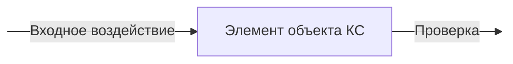
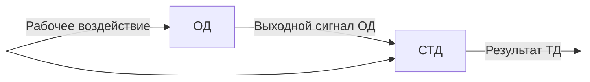
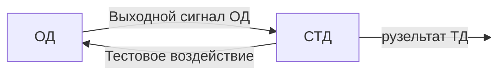
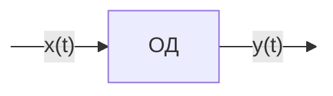
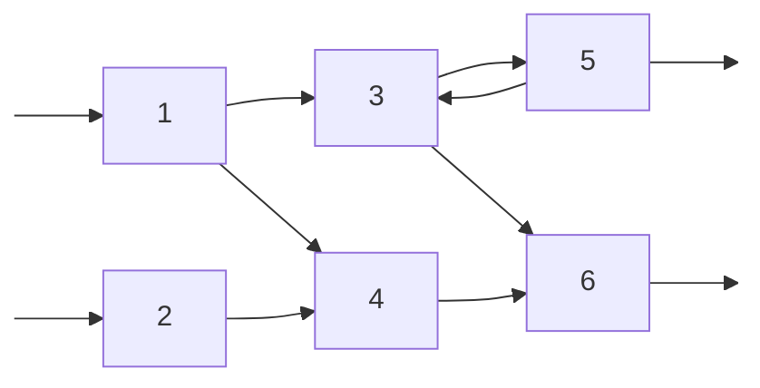

27-03-2023

Лекция 8

---

Вопросы:
1. Основные понятия и термины технической диагностики КС
2. Математические модели технической диагностики объектов КС

# Замечания
1. Необходимость в применении методов технической диагностики (из-за сложности современной компьютерной техники, особенно в последнее время) вытекает из опыта ее эксплуатации, который показывает, что на отыскание неисправности затрачивается $80-90\%$ времени простоя в неработоспособном состоянии и только $10-20\%$ - на ремонт и проверку аппаратуры
2. Применение методов технической диагностики заключается в том, чтобы создать аппаратуру максимально приспособленной к возможностям человека по определению ее технического состояния и ремонту. Это достигается за счет использования встроенных или автономных систем технического диагностирования с различной степенью автоматизации
3. Методы технической диагностики также могут использоваться для разработки оптимальных алгоритмов поиска неисправностей и при обучении технического персонала способам поиска и устранения неисправностей

# Вопрос 1
Диагностирование (диагноз) - означает распознавание, определение

Техническая диагностика (ТД) - это определение состояния некоторого технического объекта

## Основные понятия
1. Объект диагностирования
2. Процесс диагностирования
3. Поиск дефекта (неисправности)
4. Тест диагностирования
5. Алгоритм диагностирования
6. Система технического диагностирования (СТД)

Объект диагностирования (ОД) - это изделие и его составные части, техническое состояние которого подлежит определению
   
Под техническим состоянием ОД понимается совокупность подверженных изменению в процессе производства или эксплуатации свойств объекта, характеризуемая в определенный момент времени признаками (требованиями, параметрами), установленными технической документации на этот объект

Как уже рассматривалось, различают работоспособное и неработоспособное, исправное и неисправное техническое состояние ОД

Процесс определения технического состояния ОД с необходимой (определенной) точностью называется техническим диагностированием

Техническое диагностирование:
- Проверка работоспособности
- Поиск неисправности

Цель технического диагностирования, осуществляемого при подготовке к применению объекта КС - контроль работоспособности объекта. Число возможных технических состояний объекта при этом равно двум: работоспособное и неработоспособное

Дефект - это каждое отдельное несоответствие продукции установленным требованиям

Неисправность - это состояние объекта, при котором он не соответствует хотя бы одному из требования, установленных нормативно-технической документацией (НТД)

Глубина поиска неисправности задается указанием составной части объекта диагностирования или ее участка (элемента), с точностью до которых определяется место неисправности. Так, поиск неисправности может осуществляться с точностью до системы, блока, узла, радиодетали. В дальнейшем, ту часть компьютерной системы, с точностью до которой требуется определить место неисправности, будем называть элементом. Например, при контроле работоспособности (частном случае поиска неисправности) элементом является вся система

Достоверность результатов ТД зависит от кратности неисправностей, под которой понимается число одновременно отказавших элементов

Проверка - операция, заключающаяся в подаче на вход объекта некоторого допустимого воздействия и измерение на выходе в определенных контрольных точках параметров выходного воздействия

Если измеренные параметры объекта компьютерной системы находятся в допустимых пределах, то говорят, что результат проверки равен единице (исход проверки положительный), в противном случае равно нулю (исход проверки отрицательный)

Последовательность входных воздействий, которые нужно подать на исследуемый объект (элемент) для определения его работоспособности, называется допустимой последовательностью

В качестве входных воздействий могут использоваться либо рабочие сигналы (воздействия), которые подаются на объект в процессе его функционирования, либо специально вырабатываемые сигналы (тестовые воздействия). При этом в первом случае диагностирование называется функциональным, а во втором тестовым

Функциональное диагностирование:

Тестовое диагностирование:

Тест диагностирования - это последовательность (совокупность) проверок, обеспечивающих полное диагностирование объекта

Тест диагностирования:
- Проверяющий тест - предназначен для проверки исправности объекта КС
- Диагностический тест - предназначен для определения места и при необходимости причины и вида неисправности объекта КС

Система технического диагностирования (СТД) - это совокупность средств диагностирования и при необходимости исполнителей, осуществляющих диагностирования объекта КС по правилам, установленным нормативно-техничексой документацией (НТД)

Алгоритм технического диагностирования (АТД) (программа технического диагностирования) - это перечень проверок, которые необходимо выполнить, а также описание последовательности их выполнения и способа определения технического состояния КС по результатам этих проверок

В общем случае, для одной и той же компьютерной системы можно указать несколько алгоритмов технического диагностирования (АТД), различающихся либо составом проверок, либо последовательностью их выполнения, либо тем и другим.

Различают:
- Безусловные АТД, при которых множество выполняемых проверок определено заранее. Проверки выполняются параллельно или последовательно с фиксированной очередностью. При этом результат диагностирования определяется после выполнения всех проверок
- Условные АТД, при которых проверки выполняются последовательно. Каждая следующая проверка выбирается в зависимости от результата предыдущей проверки, и в этом случае техническое состояние ОД может быть определено по результатам выполнения только части проверок. Таким образом. условные АТД обеспечивают определение технического состояния ОД в среднем за меньшее число проверок

АТД:
- Условный
- Алгоритм проверки работоспособности
- Алгоритм поиска неисправности
- Безусловный

Если целью диагностирования является проверка работоспособности, алгоритм называется алгоритмом проверки работоспособности (АПР), а если поиск неисправности - алгоритм поиска неисправности (АПН)

Также тесты диагностирования подразделяются:
- Проверяющий тест (ПТ)
- Тест поиска неисправности (ТПН)

# Вопрос 2
Под математической моделью ОД понимается некоторое описание поведения объекта при исправном и неисправном его состоянии

Постановка задачи:

Для каждого ОД можно указать множество входных воздействий $X$ и множество выходных воздействий (сигналов) $Y$. Тогда математическую модуль в общем виде можно представить как некоторый оператор $F$, осуществляющий преобразование входных воздействий $x(t) \in X$ в выходные сигналь $y(t) \in T$, то есть 

$\overline{y(t)} = F\{\overline{x(t)}\}$

Если обозначить через $S = \{S_i\}, i = 1, \ldots, M$ - множество всех рассматриваемых технических состояний ОД, тогда формальное описание такого множества выглядит как $S = \{S_i\}, i = 1, \ldots, M$, то есть - это совокупность технических состояний объекта КС, при котором любые два его состояния из множества $S$ должны быть различены в результате технического диагностирования

Формальное описание множества $S$ может быть аналитическим, табличным, векторным, графическим или в другой форме

При этом математическая модель может быть:
- Явная модель объекта диагностирования представляет собой совокупность формальных описаний исправного объекта и всех его модификаций, соответствующих тем неисправностям, которые должны быть различены. Описания исправного и неисправного объектов задаются, как правило, в одной и той же форме
- Неявная модель объекта диагностирования содержит некоторое формальное описание исправного объекта, математические модели его неисправностей и правила получения по этом данным описаний неисправных объектов

В качестве универсальной явной модели ТД КС используется таблица функций неисправности (ТФН). Ее применяют при построении проверяющих и диагностических тестов аналоговых, дискретных и цифровых объектов КС

ТФН представляет собой таблицу, у которой число столбцов соответствует количеству различных состояний ОД (обычно равняется количеству функциональных элементов модели), а число строк соответствует количеству элементарных проверок ОД (то есть равны числу контрольных точек)

|$\pi \backslash S$|$S_0$|$S_1$|$S_2$|$\cdots$|$S_j$|$\cdots$|$S_{m-1}$|$S_m$|
|-|-|-|-|-|-|-|-|-|
|$\pi_1$|$R_1^0$||||$R_1^j$|||$R_1^m$|
|$\pi_2$||$R_2^1$|||$R_2^j$|||$R_2^m$|
|$\pi_3$|||||||||
|$\vdots$|||||||||
|$\pi_{N-1}$|||||||||
|$\pi_N$|$R_N^0$||||||||

ТФН строится в два этапа:
1. Строится функциональная (логическая) модель ОД
2. На основе построенной логической модели (ЛМ) заполняется ТФН

Логическая модель (ЛМ) ОД представляет собой граф-схему, на которой прямоугольниками изображают элементы ЛМ, а стрелками представляются логические связи между элементами ЛМ

В качестве элементов ЛМ выбираются такие части ОД КС, с точностью до которых требуется осуществлять поиск неисправности.

Стрелка на ЛМ означает направление передачи определенного воздействия.

При задании ЛМ ОД необходимо:
1. Перечислить все возможные для данного ОД комбинации одновременно отказавших элементов, то есть задать множество технических состояний объекта
2. Для каждого элемента указать допустимые входные и выходные воздействия
3. Задать схему объекта, удовлетворяющую следующему требованию: если выход элемента $A_i$ связан со входом элемента $A_j$, то допустимая выходная последовательность $\pi$ элемента $A_i$ должна быть допустимой входной последовательностью для $A_j$, а недопустимая последовательность $A_i$ не может вызвать допустимой выходной последовательности $A_j$
4. При построении ЛМ необходимо соблюдать правила:
	1. Каждый элемент ЛМ должен иметь только один выход, который может быть соединен со входами нескольких элементов. Число входов элемента ЛМ неограниченно
	2. Если оказывается, что элемент ЛМ имеет несколько отдельных выходов, то такой элемент должен быть расщеплен на соответствующее число одновыходовых элементов
	3. Для каждого элемента ЛМ должны быть определены допустимые значения всех входных и выходных сигналов, а также определен способ их контроля
	4. Если выходное воздействие некоторого элемента является входным для другого элемента, то их допустимые значения должны совпадать (так называемое требование согласования допусков)
	5. Недопустимое воздействие на выходе элемента ЛМ должно появляться в том случае, если этот элемент неисправен или хотя бы к одному из его входов приложено недопустимое воздействие
	6. Выходы различных элементов не должны объединяться

Построение ЛМ является одним из наиболее сложных и ответственных этапов разработки АТД

При построении необходимо запомнить главное: каждому элементу ЛМ соответствует проверка, результат которой равен $1$, если элемент работоспособен и все входные воздействия допустимы, и $0$, если не выполняется хотя бы одно из этих условий
